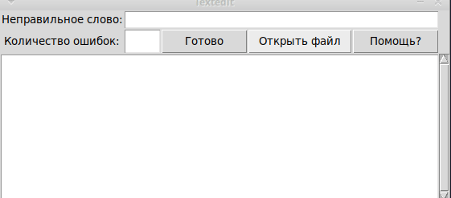

# Automated Natural Language Dictionary System

## Commands to run project

1. Create and activate virtual environment.

```terminal
python3 -m venv venv
source ./venv/bin/activate
```

2. Install reqirements

```terminal
pip install -r requirements.txt
```

3. Execute source code

```terminal
python semantic-parse.py
```

## Project featured tasks:

    * To study the theoretical material necessary to solve the problem of automatic semantic analysis of natural language text.
    * To consolidate programming skills of natural language systems and auxiliary applied programs in one of the programming languages.

## Project Requirements:

    - input - a file containing the NL text;
    - output - structures obtained by automatic semantic analysis of the input text sentences, using the functionality provided by WordNet, FrameNet, ConceptNet libraries;
    - the system interface should be extremely simple and accessible for users of any level, and contain a comprehensible set of tools and means, as well as help-means;
    - availability of means for printing out the information obtained at the output.

## Project Requests:

_**Processing Language:**_
 English

_**Functionality:**_
 [WordNet](https://wordnet.princeton.edu/)

_**Document format:**_
 *.txt -- plain text

## Demo:


## Report link:

[Report for semantic parse](https://docs.google.com/document/d/14rz9vU9b_FuH-jVBTyIYfc3EThjf3Mz37YLfoOO1oAo/edit?usp=sharing)
