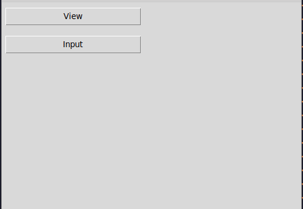

# Automated Natural Language Dictionary System

## Commands to run project

1. Create and activate virtual environment.

```terminal
python3 -m venv venv
source ./venv/bin/activate
```

2. Install reqirements

```terminal
pip install -r requirements.txt
```

3. Execute source code

```terminal
python word-analyser.py
```

## Project Requirements:

* The input - a natural language text;
* The output is a list of natural language words extracted from this text with additional information;
* The system interface must be extremely simple and accessible to users of any level, contain a clear set of tools and means, as well as help-tools;
* The system must allow the user to supplement the dictionary with all the necessary information (up to the expansion of the set of such information). For example, the means of "manual" addition of new words into the dictionary, i.e., not from the texts is mandatory;
* It is necessary to have the means of viewing, editing and updating of the existing dictionaries

## Task:
A dictionary with a list of words ordered alphabetically which includes only lexemes with additionally formed information about the place and role of a given word in a sentence. This information includes a description of what part of a sentence the word can be and in its form (case, number, tense, etc.).

## Demo:



## Report link:

[Report for word analyser](https://docs.google.com/document/d/1Y0uw7QaQIBhpsHJXb8FKADiWsUSMJaXXHesrLpov3Ls/edit?usp=sharing)

